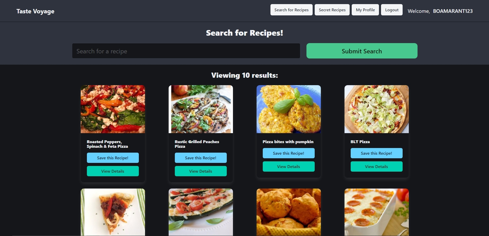

# Taste Voyage

## Table of Contents
- [Project Overview](#project-overview)
- [Installation Guide](#installation-guide)
- [Usage Instructions](#usage-instructions)
- [Key Features](#key-features)
- [Technologies Used](#technologies-used)
- [Repository Link](#repository-link)
- [Credits](#credits)
- [Screenshot of Deployed Application](#screenshot-of-deployed-application)

## Project Overview

Taste Voyage is an application that allows users to discover, save, and manage,upload their own recipes, and comment on other users' recipes. The app features a user-friendly interface where users can search for recipes, view their saved favorites, and maintain their profiles. It serves as a comprehensive tool for food enthusiasts looking to explore culinary delights while keeping their favorites organized.

## Installation Guide

1. **Clone the Repository**
* Copy the repository link and clone it to your local machine by running:
bash

git clone https://github.com/ekookten/Taste-Voyage.git

2. **Install Dependencies** 

* Open your terminal, navigate to the server directory, and run:
- npm install

* Set Up Environment Variables
- Create a .env file in the server directory 

* Launch the Server
- npm run develop

* Start the backend server by running:
- npm start

## Usage Instructions

View the Taste Voyage GitHub Repository : at the following URL: [https://taste-voyage.onrender.com](https://github.com/ekookten/Taste-Voyage). 

This project is being deployed on Render at the following URL: [https://taste-voyage.onrender.com](https://taste-voyage.onrender.com).

* Once the application is running, navigate to http://localhost:3000 in your web browser. Use the navigation bar to:

* Search for Recipes: Explore a variety of recipes based on ingredients or cuisine type.
* Secret Recipes: Access exclusive recipes that are only available to logged-in users.
* My Profile: View and edit your profile information and saved recipes.
* Logout: Securely log out of your account.

## Key Features

* User Authentication: Create, log in, and manage your account securely.
* Recipe Search: Easily search for recipes by ingredient, cuisine, or dietary preference.
* Save Favorites: Keep track of your favorite recipes in your profile.
* Responsive Design: Optimized for both desktop and mobile devices for an excellent user experience.
* Secret Recipes: Exclusive access to special recipes for registered users.

## Technologies Used

* Frontend: React
* Backend: Node.js, Express.js, GraphQL
* Database: MongoDB, Mongoose ODM
* Authentication: JWT (JSON Web Tokens)
* Styling: Bulma Framework, custom CSS
* Spoonacular API
* Apollo
* JavaScript
* Github

## Credits

This project was created by [Bo Amarant](https://github.com/boamarant), [Erkan Okten](https://github.com/ekookten), and [Goksel Gokkocabas](https://github.com/minikozort). We referenced previous activities in the bootcamp as well as utilizing tutoring for assistance.

## Screenshot of Deployed Application

